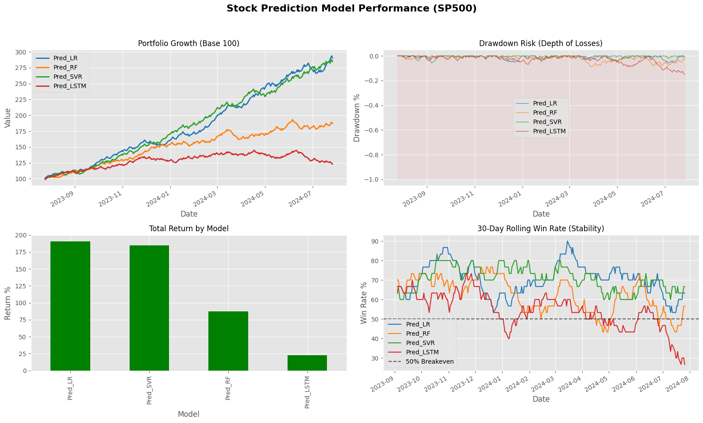

# HOPE: Targeting 1% Daily Profit
## *Stock Selection with Simple ML*

**The Goal:** Identify stocks from the Nifty 50 and S&P 500 that are primed for a quick **1% profit** immediately after market open.

This project executes a comparative analysis of machine learning models to answer a critical question: **Do we need complex Deep Learning to predict short-term stock movements, or is Simplicity enough?**

---

### 📊 At a Glance: The Surprise Winner

Contrary to popular belief, the simplest model—**Linear Regression**—significantly outperformed complex Deep Learning (LSTM) and Ensemble methods (Random Forest) for this specific short-term trading strategy.



### 🏆 Final Performance Report

| Model | Total Return % | Win Rate % | Sharpe Ratio | Max Drawdown % |
| :--- | :--- | :--- | :--- | :--- |
| **Linear Regression (LR)** | **190.65%** | **70.61%** | **7.17** | **-5.86%** |
| Support Vector Regressor (SVR) | 184.89% | 70.23% | 7.01 | -5.85% |
| Random Forest (RF) | 87.18% | 62.21% | 3.99 | -8.66% |
| LSTM (Deep Learning) | 22.99% | 54.20% | 1.34 | -15.09% |

> **Key Insight:** For identifying simple linear relationships in daily opening volatility, LSTM models proved too complex and noisy, while Linear Regression captured the signal with high efficiency (70% Win Rate).

---

### 📂 Key Files

-   **`hope6.ipynb`**: The core engine. Run this notebook to train models on historical data and generate the "buy today" prediction list.
-   **`predictions/`**: Contains the daily output files listing stocks that fit the 1% profit criteria.
-   **`results_overview.png`**: Visual summary of the backtesting results.

### 🚀 Usage

1.  **Install dependencies:**
    ```bash
    pip install -r requirements.txt
    ```
2.  **Run the analysis:**
    Open `hope6.ipynb` and execute the cells to download fresh data, retrain models, and view today's stock picks.
3.  **Check the output:**
    Review the generated CSV in the `predictions/` folder for the ticker symbols with the highest predicted probability of a 1% gain.

### 🧠 Models Compared
-   **Linear Regression** (The Winner 🥇)
-   **SVR** (The Runner-up 🥈)
-   **Random Forest**
-   **LSTM** (Long Short-Term Memory)
